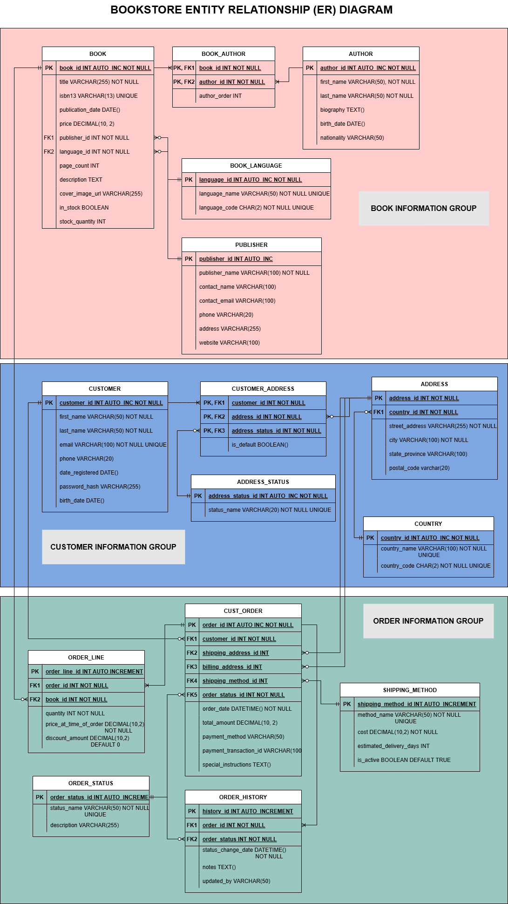

# BookstoreDB: MySQL Database for Bookstore Management


## Overview

BookstoreDB is a comprehensive MySQL database solution designed to manage all aspects of a bookstore's operations, including inventory management, customer data, order processing, and shipping. This project implements a normalized relational database with proper integrity constraints, indexing for performance, and user access control.

## Features

- **Complete Bookstore Management:** Handles books, authors, customers, orders, and shipping
- **Normalized Schema Design:** 15 properly normalized tables with appropriate relationships
- **Data Integrity:** Enforced through constraints, foreign keys, and validation
- **Performance Optimization:** Strategic indexes for common query patterns
- **Security Model:** Role-based access control with the principle of least privilege
- **Comprehensive Documentation:** Detailed schema documentation and usage guides
- **Sample Data:** Realistic test data for all tables
- **Test Queries:** Sample queries for common operations and reporting

## Database Structure

The database consists of 15 tables organized in three main functional areas:

1. **Book Information** - Tables for books, authors, languages, and publishers
2. **Customer Information** - Tables for customers, addresses, and countries
3. **Order Information** - Tables for orders, order lines, shipping, and status tracking



## Installation and Setup

### Prerequisites

- MySQL Server 8.0 or higher
- MySQL Workbench (recommended for administration)

### Quick Start

1. Clone this repository:
   ```bash
   git clone https://github.com/NMsby/BookstoreDB.git
   ```

2. Navigate to the project directory:
   ```bash
   cd BookstoreDB
   ```

3. Connect to your MySQL server:
   ```bash
   mysql -u root -p
   ```

4. Run the complete setup script:
   ```sql
   source sql/00_setup_complete_database.sql
   ```

   This will:
   - Create the bookstore_db database
   - Create all required tables
   - Set up user roles and permissions
   - Populate the database with sample data

### Individual Setup Steps

If you prefer to run the scripts individually:

1. Create the database:
   ```sql
   source sql/01_create_database.sql
   ```

2. Create book-related tables:
   ```sql
   source sql/02_create_tables_books.sql
   ```

3. Create author and order-related tables:
   ```sql
   source sql/03_create_tables_authors_orders.sql
   ```

4. Create customer and shipping-related tables:
   ```sql
   source sql/04_create_tables_customers_shipping.sql
   ```

5. Set up user roles and permissions:
   ```sql
   source sql/05_create_users.sql
   ```

6. Load sample data:
   ```sql
   source sql/06_sample_data.sql
   ```

## Usage Examples

### Basic Query Examples

Retrieve all books by a specific author:
```sql
SELECT b.title, b.isbn13, b.price
FROM book b
JOIN book_author ba ON b.book_id = ba.book_id
JOIN author a ON ba.author_id = a.author_id
WHERE a.last_name = 'Tolkien';
```

Get total sales by month:
```sql
SELECT DATE_FORMAT(order_date, '%Y-%m') AS month, 
       COUNT(*) AS order_count, 
       SUM(total_amount) AS total_sales
FROM cust_order
GROUP BY month
ORDER BY month;
```

### More Examples

For more example queries, see:
- [Sample Queries](sql/07_test_queries.sql) - Common operational queries
- [Analytical Queries](sql/08_analytical_queries.sql) - Business intelligence queries

## Data Validation

To validate database integrity:
```sql
source sql/09_database_validation.sql
```

This will run a series of tests to ensure data consistency and integrity.

## Documentation

- [Schema Description](docs/schema_description.md) - Detailed table and column documentation
- [User Access Control](docs/user_access_control.md) - Security model and permissions

## Project Structure

```
BookstoreDB/
├── README.md                         # Project overview
├── bookstore.sql                     # Complete database sql implementation
├── docs/                             # Documentation
│   ├── ER_Diagram.png                # Database diagram
│   ├── schema_description.md         # Table descriptions
│   └── user_access_control.md        # Security documentation
├── sql/
│   ├── 00_setup_complete_database.sql # All-in-one setup script
│   ├── 01_create_database.sql        # Database creation
│   ├── 02_create_tables_books.sql    # Book-related tables
│   ├── 03_create_tables_authors_orders.sql # Author and order tables
│   ├── 04_create_tables_customers_shipping.sql # Customer tables
│   ├── 05_create_users.sql           # User roles and permissions
│   ├── 06_sample_data.sql            # Test data
│   ├── 07_test_queries.sql           # Sample queries
│   ├── 08_analytical_queries.sql     # Business analysis
│   └── 09_database_validation.sql    # Integrity checks
└── presentations/                    # Presentation materials
```

## Contributors

- [Nelson Masbayi](https://github.com/NMsby) - Leader, Book & Publishing Tables
- [Lina Murithi](https://github.com/Ar-murithi) - Authors & Order Processing
- [Ivy Anyango](https://github.com/IvyAdev) - Customer & Shipping Management

## License

This project is licensed under the MIT License - see the [LICENSE](LICENSE) file for details.

## Acknowledgements

- Assignment created as part of the Database Design Module for Power Learn Project Academy Software Engineering Progrm - Cohort VII February 2025
- Thanks to our instructor Zablon for guidance and support